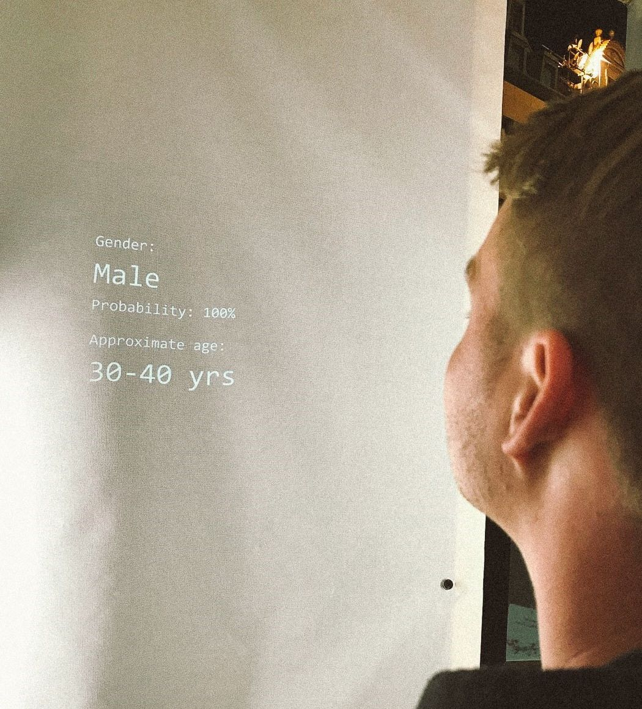
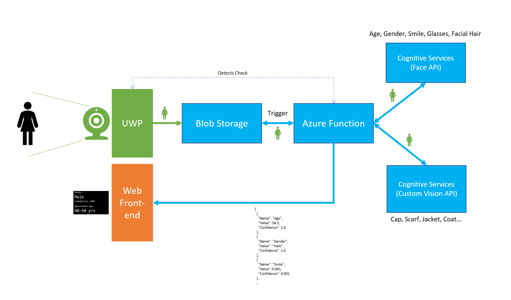
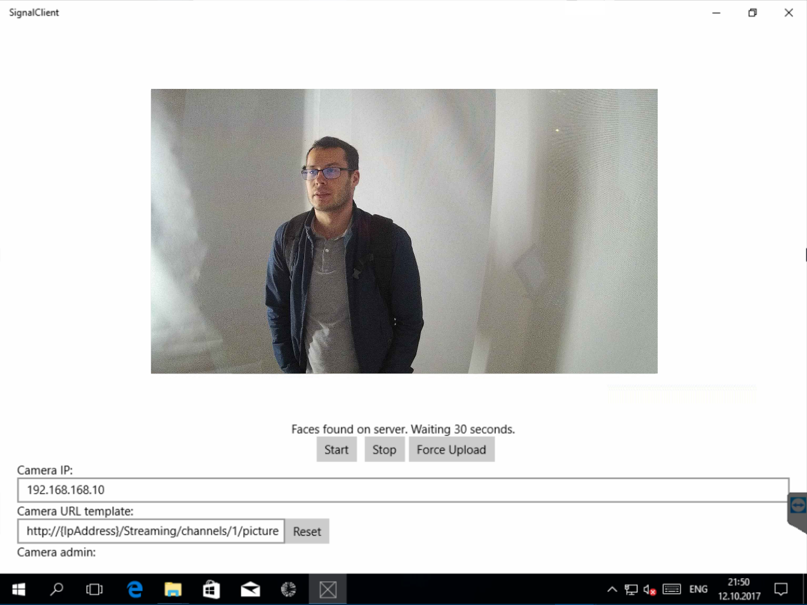

# Signal Faces
This project was built for the *Anonymous Illusion* art installation at Signal Festival 2017 in Prague.


its goal was to create a space that broadened people’s minds and offered them not only an insight into illusionary anonymity but also a taste of technology of the future.



You can find the full story on my blog.

This repo hosts the client & server applications.



## Prerequisites

Several things need to be created before you can run this system:

1. You need to have a Microsoft Azure account (if you don't, try the [free Trial](https://azure.microsoft.com/en-us/free/)).
2. Create a **Storage Account** resource in Azure.
   1. Copy **Connection String** for this account.
   2. Create a **Container** in this account (I called it *photos*).
   3. Generate and copy a **SAS token** for this container (the easiest way is to [use Storage Explorer](https://docs.microsoft.com/en-us/azure/vs-azure-tools-storage-manage-with-storage-explorer#attach-a-storage-account-by-using-an-sas)).
3. Create a **Cognitive Services Face API** resource in Azure.
   1. Copy **API Key** and **Endpoint URL**.
4. Create a **Custom Vision** model at https://customvision.ai.
   1. Copy **Prediction Key** and **Prediction Endpoint**.
5. Create a **Cosmos DB** account and a database.
   1. Copy **Connection String**.
6. Make sure you have the [**Azure Functions Tools** installed in Visual Studio](https://docs.microsoft.com/en-us/azure/azure-functions/functions-develop-vs) and Functions CLI on your PC.
7. Make sure you have the UWP tools installed in Visual Studio.
8. Create a listenting endpoint which would receive the tags from processing function (needs to be a POST API, accessible from the internet).

## Setup

Clone this repo:

```
git clone https://github.com/msimecek/Signal-Faces.git
```

**Open the *SignalFunc.sln* solution.**

Rename `local.settings.json-empty` to `local.settings.json`.

Open `local.settings.json` and fill in your connection strings, API keys etc.

*Use your Storage Account connection string for the `AzureWebJobsStorage` property. You can leave `AzureWebJobsDashboard` empty.*

Build & Run to see if everything is OK.

**Open the *SignalClient.sln* solution.**

Go to *Services\StorageService.cs* and paste your container's SAS URL to `CONTAINER_SAS`.

Connect your IP camera, so that it's accessible over the network.

Run the app.

Use the UI to configure camera's snapshot template and other parameters.

| Element             | Functionality                            |
| ------------------- | ---------------------------------------- |
| Start button        | Starts camera capture                    |
| Stop button         | Stops camera capture                     |
| Force upload        | Uploads current capture immediately      |
| Camera IP           | IP address of the camera. It's better when the camera is on the same local network. |
| Camera URL template | Every camera has a specific URL from which you can download current snapshot. Use {IpAddress} to indicate where in the string is the address. |
| Camera admin        | Administrator username for access to the camera. |
| Camera pass         | Admin password.                          |
| Capture interval    | How often will the app download a new image (in seconds). We used 2 seconds. |
| Delay after upload  | How long will the app wait after uploading to Storage before starting new capture (in seconds). |
| Upload enabled      | If unchecked, no image will be uploaded to storage. |
| Apply button        | Save configuration and restart capture.  |



## Remarks

This project was built in less than a week and properly tested only in production :) Hence the code... Not pretty all the time. 

But hey - pull requests welcome!